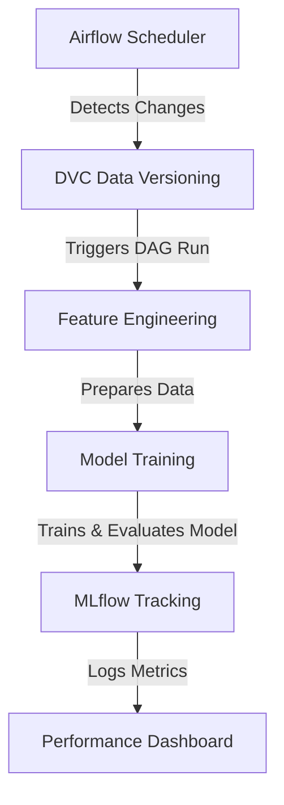

# 🚀 **Automating Machine Learning Pipelines with Apache Airflow**  

  
  
  
  
  

## 📌 **Project Overview**  
This project implements a **fully automated MLOps pipeline** for a **K-Means clustering model** using **Apache Airflow**. The pipeline ingests data, preprocesses it, performs feature engineering, trains a model, and logs results—all in an **event-driven** workflow.  

The dataset comes from a **Kaggle e-commerce dataset**, and the project focuses on:  
✅ Automating data ingestion & preprocessing  
✅ Ensuring model reproducibility with **DVC & MLflow**  
✅ Deploying **Apache Airflow** for **workflow orchestration**  
✅ Continuous monitoring & retraining based on **parameter changes**  

## 🔧 **Tools & Technologies Used**  
To build a **scalable MLOps pipeline**, the following technologies were integrated:  

| **Technology**       | **Purpose**                                          |
|----------------------|------------------------------------------------------|
| **Apache Airflow** 🏗️  | Workflow orchestration & scheduling                  |
| **DVC (Data Version Control)** 📊 | Data tracking & versioning for reproducibility |
| **MLflow** 🔎        | Model tracking, experiment logging, and evaluation |
| **Python, Pandas, Scikit-learn** 🐍 | Data processing & K-Means model training |

---

## ⚙️ **How It Works**  
This pipeline is **event-driven** and continuously monitors dataset & parameter updates.  

### **Workflow Breakdown**  
1️⃣ **Airflow detects dataset/parameter changes** 📡  
2️⃣ **Triggers DVC** to ensure data version consistency 📂  
3️⃣ **Feature engineering & preprocessing** are executed 🔄  
4️⃣ **Retrains the K-Means model** based on latest data 🎯  
5️⃣ **MLflow logs metrics & hyperparameters** for monitoring 📈  

---

## 🚀 **Project Architecture**  



---

## 🛠 **Setup & Installation**  

### **1️⃣ Clone Repository**  
```bash
git clone https://github.com/muntakim1/machine-learning-pipeline-airflow-mlflow-dvc.git
cd machine-learning-pipeline-airflow-mlflow-dvc
```

### **2️⃣ Install Dependencies**  
```bash
pip install -r requirements.txt
```

### **3️⃣ Initialize DVC & MLflow**  
```bash
dvc init
mlflow server --backend-store-uri sqlite:///mlflow.db --default-artifact-root ./mlruns
```

### **4️⃣ Start Apache Airflow**  
```bash
airflow db init
airflow scheduler & airflow webserver
```

### **5️⃣ Trigger DAG in Airflow**  
```bash
airflow dags trigger ml_pipeline
```

---

## 📊 **Performance & Scalability**  

- **Automates model retraining** based on **data drift detection**  
- **Ensures model reproducibility** with **DVC & MLflow**  
- **Scales efficiently** with **Airflow's DAG scheduling**  
- **Continuous monitoring** of metrics & hyperparameters  

---

## 🏆 **Key Takeaways**  
✅ **Fully automated** end-to-end **MLOps pipeline**  
✅ **Dynamic parameter tuning** for **real-time model updates**  
✅ **Seamless data & model tracking** with **DVC & MLflow**  
✅ **Scalable Airflow DAGs** for **production-ready workflows**  

---

## 💼 **Looking for Opportunities!**  
I am actively **seeking Data Science roles** where I can leverage my expertise in **Machine Learning, MLOps, and Automation** to build **scalable AI solutions**.  

📩 **Let’s connect!** [LinkedIn](https://www.linkedin.com/in/your-profile) | [Email](mailto:your.email@example.com)  

---

### 📜 **License**  
This project is licensed under the [MIT License](LICENSE).  

🔹 **Contributions are welcome!** Feel free to fork this repo, submit issues, and create pull requests! 🚀  

#DataScience #MachineLearning #MLOps #ApacheAirflow #DVC #MLflow #AI #Automation #Hiring #OpenToWork 🚀